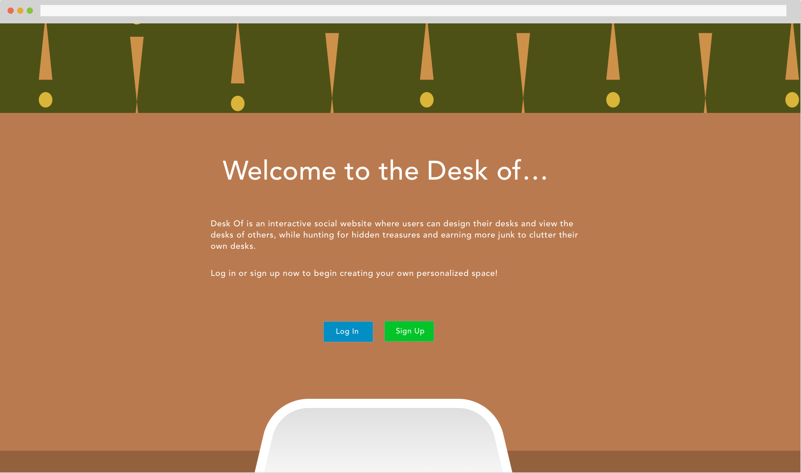

#Welcome to the DeskOf...

Desk Of is an interactive social website where users can design their desks and view the desks of others, while hunting for hidden treasures and earning more junk to clutter their own desks.

---
###Technologies Used

* **Django**
* **Python**
* **JQuery**
* **CSS**
* **HTML**
* **Sketch**

---

###How to install DeskOf

1. Fork and clone repo.

2. In your terminal, run:

```bash
		git clone [insert or paste link]
	```

3. Drill down into the project folder:

```bash
		cd desk-of
	```

4. Start up your local server to see the webpage:

```bash
		python manage.py runserver
	```

  Head to the address given in your terminal and you should see the application!

---

##Planning

---

###User Stories

* User could be anyone as the app will be highly personalized.

* User starts on landing page where they must create an account (Stretch is to implement Facebook or Gmail auth). There will also be a brief description of the app on the landing page.

* User is then taken to their personal desk (View of desk with multiple objects on it)

* User will hopefully be enticed to click around and explore without prompts. User can click on objects on the screen and they will then be routed to respective pages.

* User should be able to add personality to each section, be able to update, delete and view each submission they have made.

* User should be able to log out, and redirect to landing page.

---

###Wireframes

Created wireframes in Sketch.


